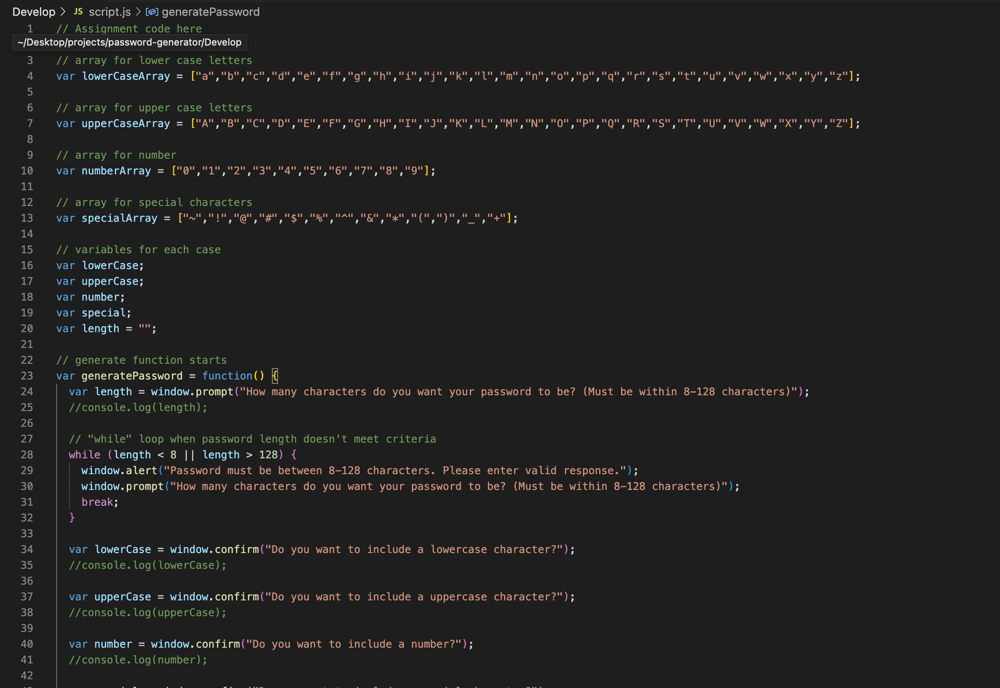

# Password Generator

## Description

This password generator creates a random password using at least one of the parameters. The parameters are lower case, upper case, number and/or special characters. There is a prompt that indicates to the user how long the password can be. This generator uses a loop when the user inputs an invalid value for the length of the password. Bringing the user back to the initial prompt until a valid value is met. When all the prompts are answered, a random password is generated based on the user's choices.

